# Podkladni.sk 🚀

## Description

PodkladniSk is a powerful application designed to revolutionize the management of contracts and tenders for government institutions. It enables seamless collaboration between Uradnik and Podkldanik, enhancing operational efficiency.

## Website 🌐

[Podkladni.sk](https://podklady-sk.netlify.app/)

### Registration 📝
Registration page, where you can also register via IS EVO and Google account

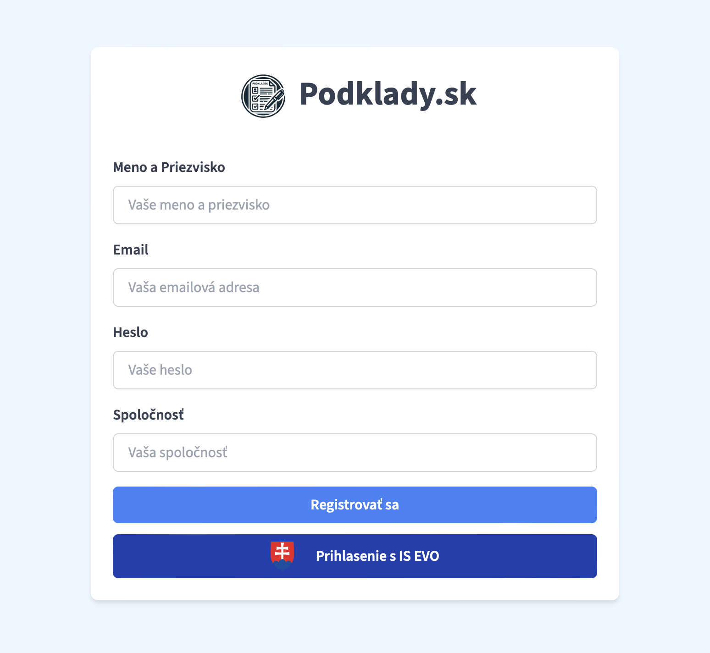

### Home Page 🏠
The main page contains various copies of contracts and tenders, as well as the ability to search for documents, view usage, evaluation and comments

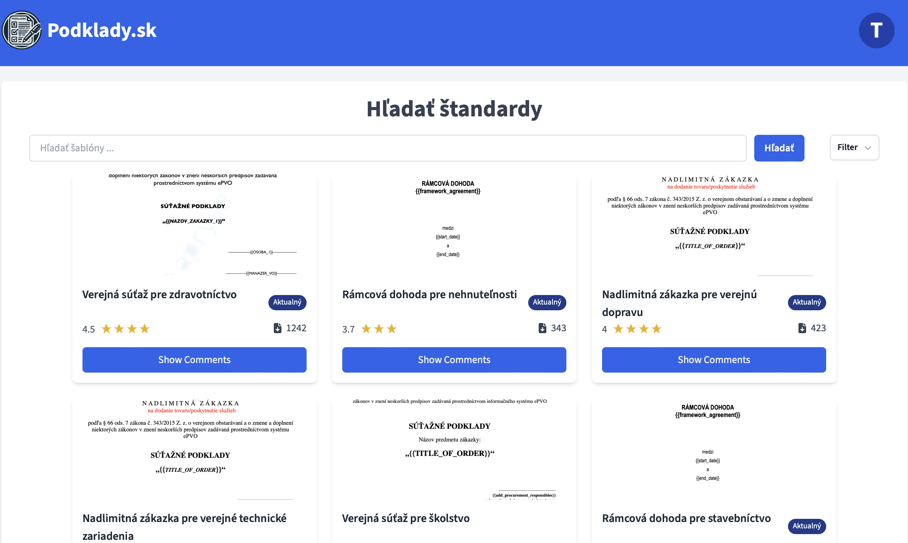

### Editing Area ✏️
**The main page contains various copies of contracts and tenders, as well as the ability to search for documents, view usage, evaluation and comments**

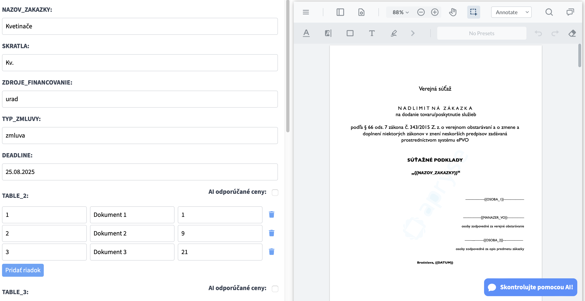

**An area for editing documents, where you can find various tools for formatting and modifying contracts**

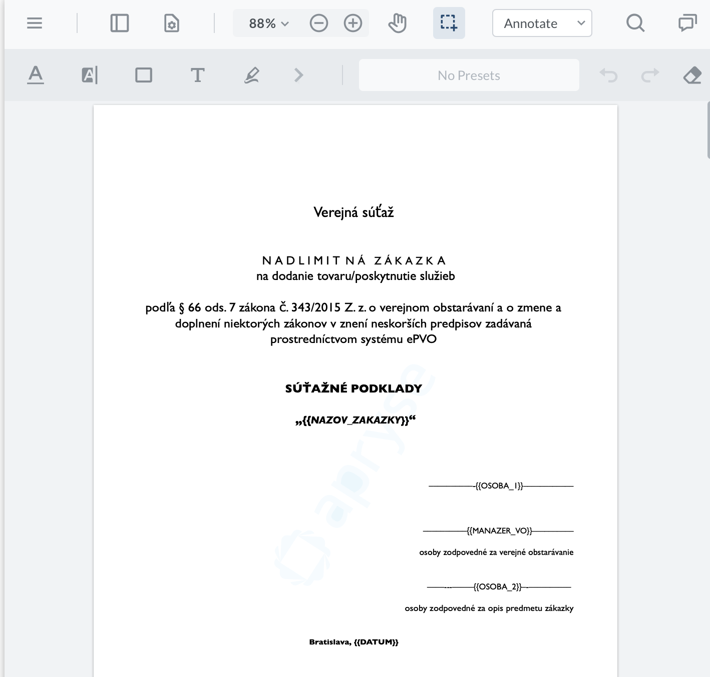
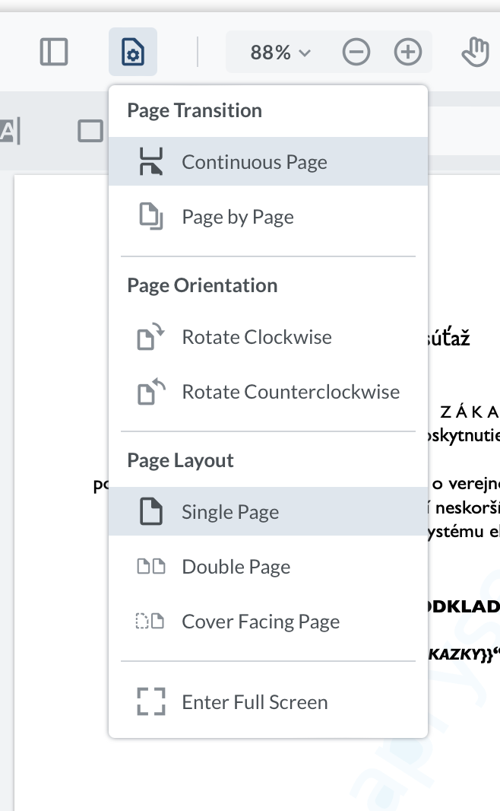
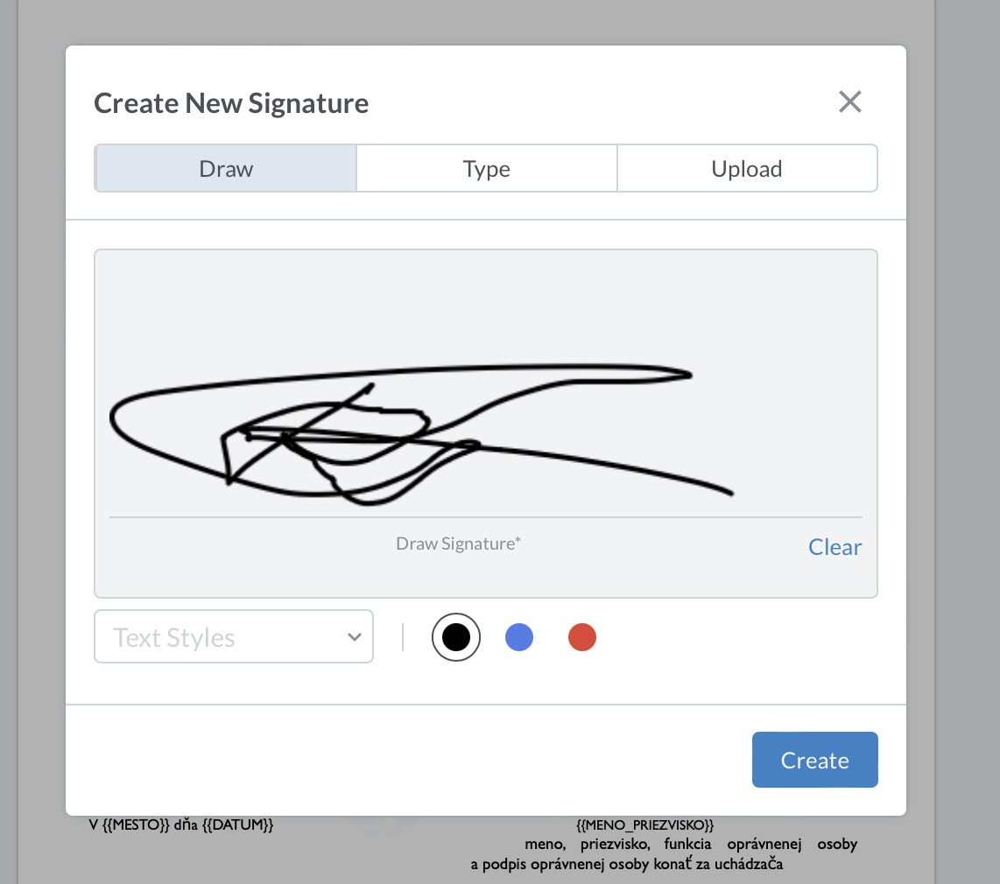

**Area for commenting on the contract**

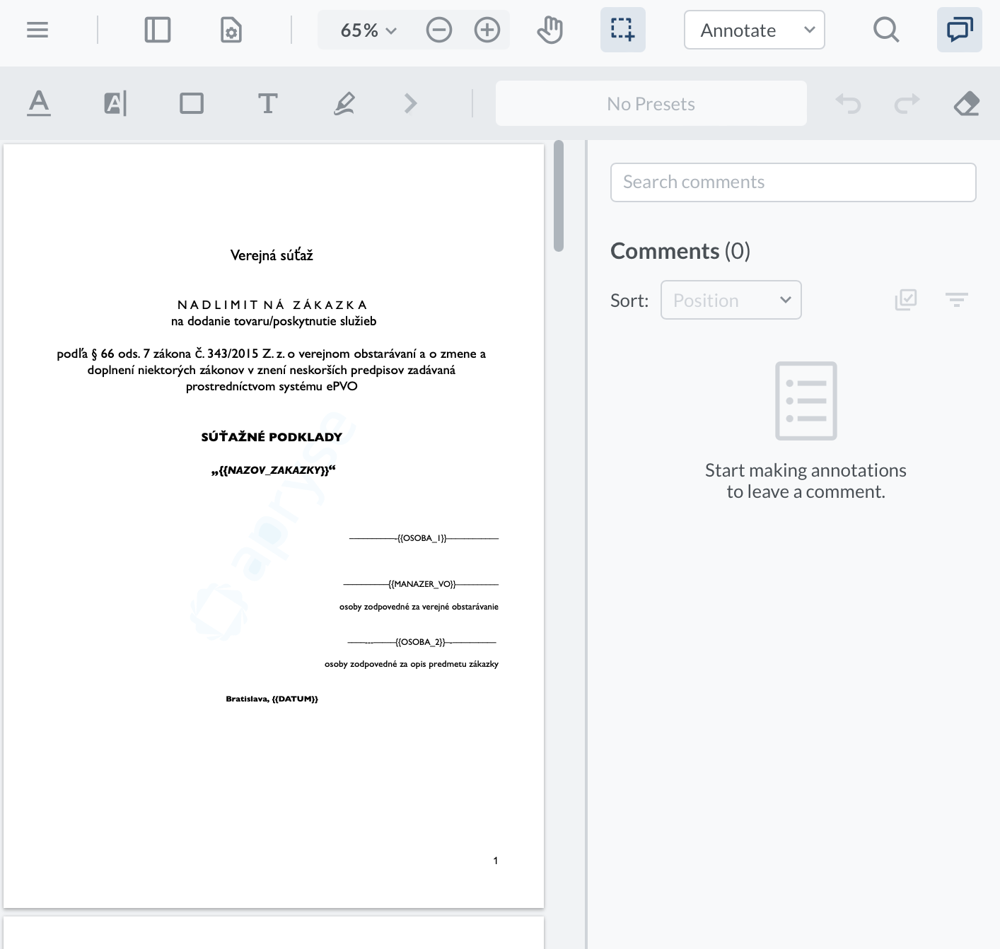

**Also, in the area of data filling, we can use the ability to offer prices for purchases using Artificial Intelligence**

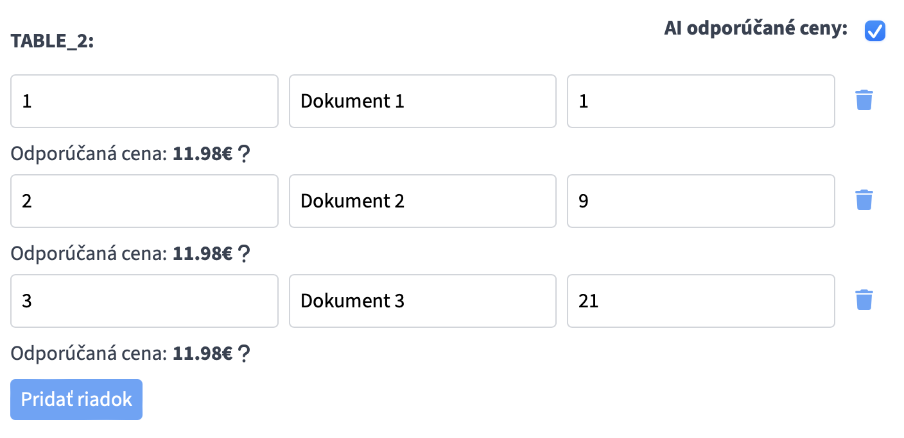

**Artificial Intelligence can also explain why it decided to offer this particular price and show a graph that will describe more specifically**

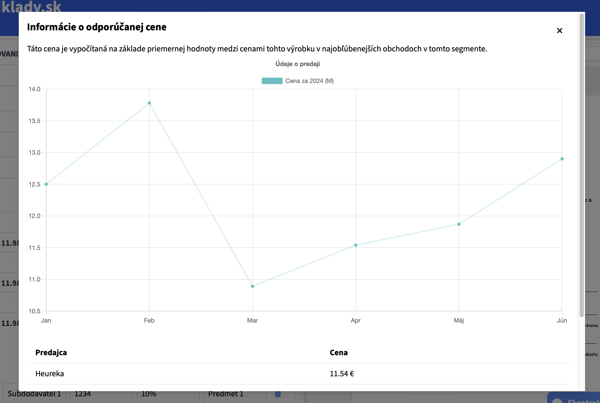

## API Integration 🔗

Our application also has possible integrations with other applications. We have an established API for receiving updated templates and retrieving saved documents

### API Screenshots 📊

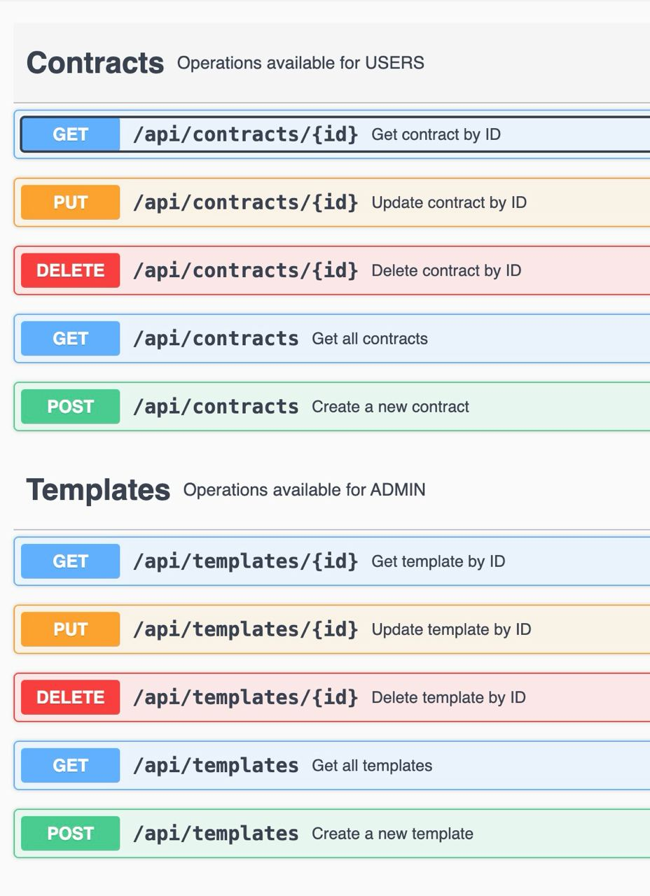

**Data that can be obtained from the API**

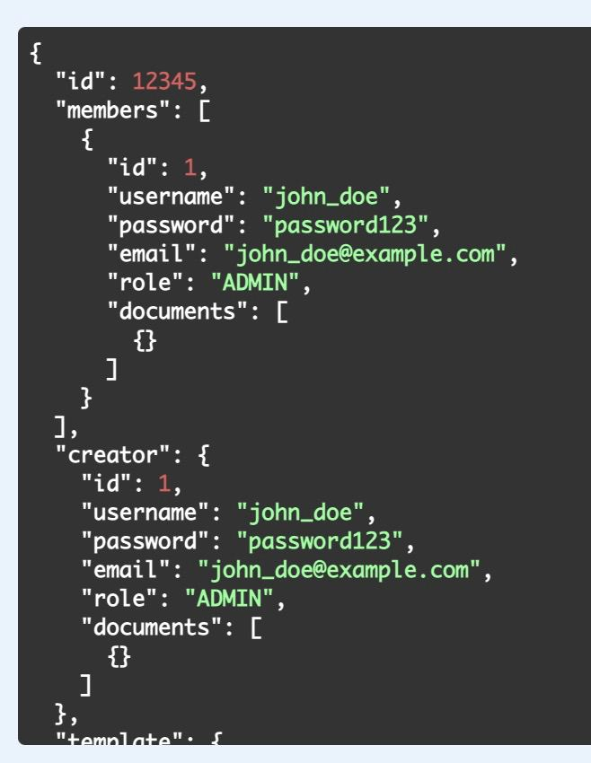

## Frontend 🖥️

- React
- Webviewer API

## Backend 🗄️

- Spring Java
- MongoDB
